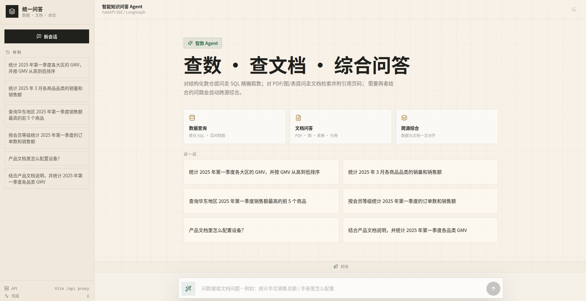
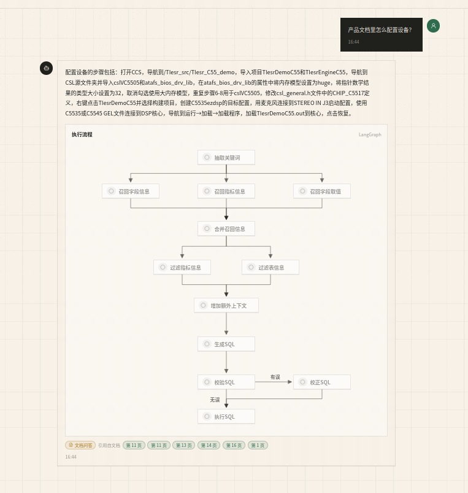

<div align='center'>
  <h1 style="margin-top: 15px;">「智数」智能数据分析 Agent</h1>
  <h4><b>zhishu-agent</b></h4>
  <p><em>可能是全网最适合用于系统学习 LangGraph 的智能问数实战项目——带你打通「元数据混合检索 + 多阶段推理 + SQL 生成与自愈执行 + SSE 流式交付」的完整工程链路，并额外内置一套进程内多模态文档问答引擎，实现数据与文档的统一问答。</em></p>
</div>

<div align='center'>


</div>

**📢 项目定位**：一个可独立运行、前后端齐全、代码全中文注释的 AI Agent 实战工程。它不做"模型直出答案"的玩具演示，而是完整实现一条真实企业问数链路，并在此之上扩展了文档问答与跨源综合能力，适合作为系统学习 `LangGraph` / 混合检索 / Agent 工程的最佳入门与进阶项目。

如果你是来找一个适合学习 `LangGraph`、`Qdrant`、`MySQL`、`FastAPI` 和 AI Agent 工程开发的实战项目，「智数」很可能是最适合你的那一个。

它不是只调用一次大模型接口，也不是写几个 Prompt 演示 SQL 生成结果。这个项目围绕电商数仓问数场景，先构建元数据知识库，再做字段、指标、字段取值的混合检索，随后用 LangGraph 编排多阶段问数流程，完成 SQL 生成、校验、修正、执行和前端流式展示。换句话说，你学到的不是某一个框架 API，而是一条 AI 应用从数据准备、检索增强、智能体编排、接口交付到前端联调的完整项目主线。



## 📖 项目介绍

在真实问数场景里，业务同学通常不会写 SQL，数据分析同学也很难随时记住所有表结构、字段含义、指标口径和字段取值。单纯把自然语言问题直接交给大模型，很容易出现表选错、字段选错、指标理解错和 SQL 幻觉等问题。

`智数` 要解决的就是这个问题：

- 用户用自然语言提问
- 系统自动召回相关字段、指标和字段取值
- 大模型基于上下文进行分步推理
- 生成 SQL 并查询数据仓库
- 以流式方式返回分析结果

除数据分析外，`智数` 还内置了一个**进程内多模态文档问答引擎**（`app/rag_engine/`），可对 PDF/图/表类文档提问并返回引用页码；当问题同时需要数仓数据与文档内容时，自动进入 **hybrid 跨源综合**：数据链与文档链并行执行后合并给出结论。所有链路统一走 SSE 流式返回前端。

### 💬 它能回答什么样的问题？

打开前端聊天界面，你可以直接这样问：

| 类型 | 示例问题 | 走的路由 |
| ---- | -------- | -------- |
| 📊 数据查询 | `统计华北地区的销售总额` | `sql` → 召回 → 生成 SQL → 执行，返回结果表格 |
| 📑 文档问答 | `手册里怎么配置 XX 参数` | `doc` → 进程内文档引擎，返回答案 + 引用页码 |
| 🔀 跨源综合 | `结合数仓数据和产品文档，分析华东销售下滑原因` | `hybrid` → 数据链 + 文档链并行，LLM 综合结论 |
| 💬 闲聊 | `你是谁？会做什么` | `chat` → 轻量模型直接回复，不消耗业务链路 |
| 🧠 追问复用 | `那按月再看呢` / 相似问题二次提问 | `knowledge` → 命中知识沉淀直接复用，秒回 |

> 路由由入口的 `classify_route` 节点自动判别（本地特征词快判 + LLM 兜底），**用户无需关心走哪条链**，只负责问。
>
> 📌 `sql` / `chat` 无需额外数据即可体验；`doc` / `hybrid` 需要先准备文档引擎索引（见「快速开始 → 文档问答能力」，未配置时自动降级为提示消息，不影响 SQL 侧结论）。

## ✨ 项目亮点

- **数据分析 + 文档问答 + 跨源综合三合一**
    - sql 路由走数仓 SQL 精确取数；doc 路由走进程内文档引擎并附引用页；hybrid 路由并行扇出两条链后由 LLM 综合。
- **检索 + 推理 + 生成，而不是模型直出 SQL**
    - 先围绕问题召回相关字段、指标和值域，再组织上下文生成 SQL，整体链路更稳、更可控。
- **面向企业问数场景的混合检索**
    - 字段、指标走 `Qdrant` 向量语义召回，字段取值走 `Elasticsearch` 全文检索，权威结构元数据存 `MySQL`——字段、指标、取值三类信息协同召回，比单纯表级检索更贴近真实分析流程。
- **SQL 生成→校验→自愈→执行 的完整闭环**
    - 不停留在 Prompt 设计，而是真实生成 SQL、EXPLAIN 校验、失败自动修正、运行时错误回炉重试（`sql_subgraph` 拓扑，`sql_attempts` 上限保护），最终执行并流式返回结果。
- **LLMWiki 式知识沉淀（会越用越聪明）**
    - 每次 sql/doc/hybrid 问答结束后，有价值的结论自动沉淀进知识库；下次遇到相似问题直接召回复用、秒级返回，并累加命中次数（`hit_count`）。
- **工程化后端结构清晰**
    - 基于 `FastAPI + LangGraph + Repository + Client Manager` 组织配置、客户端、仓储层、服务层与智能体流程，模块边界清楚，便于维护和扩展。
- **支持多轮会话与追问**
    - 基于 `InMemorySaver` 的 `thread_id` 会话记忆，支撑"那按月呢"这类省略式追问；入口 `classify_route` 注入历史上下文还原真实意图。
- **前端实时展示 LangGraph 执行流程**
    - React 界面不只显示答案，还把"抽取关键词 → 召回 → 生成 SQL → 校验 → 执行"的每一步以流程图形式流式点亮，过程完全可见。

这套项目特别适合这些学习场景：

- 想系统学习 `LangGraph`，但不想只停留在几个玩具节点——这里有真实的多分支条件路由、并行扇出与子图复用。
- 想把 `MySQL`、`Qdrant`、`Elasticsearch` 和大模型放进同一个业务场景里理解"混合检索 + RAG"。
- 想理解"让 LLM 自己写 SQL 并跑通"需要解决哪些工程问题（召回准确性、SQL 幻觉、自愈、口径守卫）。
- 想把项目写进简历，并能说清楚数据层、检索层、智能体层、服务层和前端层分别做了什么。

## 🏗️ 系统架构


项目围绕两条主线展开：

| 主线             | 做什么                                                                   | 涉及模块                                     |
| ---------------- | ------------------------------------------------------------------------ | -------------------------------------------- |
| 元数据知识库构建 | 抽取教学数仓中的表、字段、指标和字段取值，写入结构化库、向量库和全文索引 | `MySQL` / `Qdrant` / `Elasticsearch` / `TEI` |
| 自然语言问数     | 基于用户问题完成召回、上下文整理、SQL 生成校验执行，并把过程流式返回前端 | `LangGraph` / `FastAPI` / `SSE` / `React`    |



### 🔀 一次 SQL 问数的完整旅程（看懂这张图）

前端那条自上而下点亮的流程图，背后是 `app/agent/graph.py` 里的一张 LangGraph 状态机：

```text
START
  └─ classify_route           意图路由闸门：判定走哪条链（见上表五类路由）
       └─ [sql 路由] extract_keywords        抽取关键词（jieba + LLM 扩展）
            ├─ recall_column   字段召回（Embedding → Qdrant 向量库）
            ├─ recall_metric   指标召回（Embedding → Qdrant 向量库）
            └─ recall_value    字段取值召回（Elasticsearch 全文）
                 └─ merge_retrieved_info     合并、按 id 补齐结构元数据
                      ├─ filter_table_info    过滤候选表
                      ├─ filter_metric_info   过滤候选指标
                      └─ add_extra_context    补日期/方言等上下文
                           ├─ generate_sql    LLM 依据上下文生成 SQL
                           ├─ validate_sql    先 EXPLAIN 校验语法与计划
                           │    └─ 有误 → correct_sql → 再 validate_sql（自愈）
                           ├─ run_sql         执行查询，失败回炉重试（≤2 次）
                           ├─ verify_result   结果自检（可疑时前端弹提醒）
                           └─ synthesize      收口，SSE 返回前端
```

- **sql 路由**：完整走上面 12 个节点，真实执行 SQL 返回结果表格；
- **doc 路由**：单独走 `doc_query`，调用进程内文档引擎拿答案与引用页码；
- **hybrid 路由**：`hybrid_split` 把同一问题并行扇出到 SQL 链与 doc 链，两者都完成后由 `synthesize` 用 LLM 综合成三段式结论（前端可见"【数据结论】【文档说明】"分块流式输出）。

## 🛠️ 项目技术栈

| 模块          | 技术                             | 作用                                                     |
| ------------- | -------------------------------- | -------------------------------------------------------- |
| 教学数仓      | `MySQL`                          | 模拟事实表、维度表和分析型查询环境                       |
| 元数据库      | `MySQL` / `SQLAlchemy`           | 保存表、字段、指标、字段指标关系等结构化元数据           |
| 向量检索      | `Qdrant` / `NanoVectorDB`        | 字段、指标向量召回；文档引擎的本地页面/元素向量库        |
| 全文检索      | `Elasticsearch`                  | 保存字段真实取值，支持关键词和值域检索                   |
| Embedding     | `TEI` / `BAAI/bge-large-zh-v1.5` | 智数主链路将字段、指标、问题文本转向量                   |
| 语义重排      | `TEI` / `BAAI/bge-reranker-base` | 召回后 cross-encoder 精排截取 top_k（fail-open 降级）     |
| 智能体编排    | `LangGraph`                      | 组织多阶段问数工作流、条件路由、并行扇出、子图复用       |
| 文档问答引擎  | `app/rag_engine/`（多模态 Agent）| 内置进程内文档问答：页面/元素索引 + VLM + 引用页码       |
| 模型接入      | `LangChain` / OpenAI 兼容协议     | 封装主链路 LLM 与文档引擎的硅基流动调用                  |
| 后端接口      | `FastAPI`                        | 提供问数 API、依赖注入和生命周期管理                     |
| 流式协议      | `SSE`                            | 实时返回节点进度、查询结果、文档答案与错误消息           |
| 前端          | `React` / `Vite` / `Tailwind CSS` | 提供聊天式问数界面与执行流程可视化          |
| 日志追踪      | `ContextVar` / `loguru`           | 为并发请求注入 request_id，便于排查链路      |
| 依赖管理      | `uv` / `pnpm`                     | 管理 Python 后端与前端依赖                   |

## 📁 项目结构

```text
zhishu-agent/
├── app/
│   ├── agent/            # LangGraph 图、状态、上下文和各类节点（graph.py 等）
│   ├── rag_engine/       # 内置进程内多模态文档问答引擎（原独立 RAG 方案，已融入）
│   ├── api/              # FastAPI 路由、依赖注入、生命周期和请求结构
│   ├── clients/          # MySQL、Qdrant、ES、Embedding、文档引擎客户端管理
│   ├── conf/             # 配置 dataclass 与配置加载工具
│   ├── core/             # 日志、request_id 上下文等通用能力
│   ├── entities/         # 更贴近业务语义的数据对象
│   ├── models/           # SQLAlchemy ORM 模型
│   ├── prompt/           # Prompt 加载工具
│   ├── repositories/     # MySQL、Qdrant、Elasticsearch 数据访问层
│   ├── scripts/          # 元数据知识库构建脚本
│   └── services/         # 元数据构建、知识沉淀与问数查询服务
├── conf/                 # app_config.yaml、meta_config.yaml（运行时配置）
├── data/                 # 文档引擎索引与缓存（doc_index/、vlm_cache/，不入 git）
├── docker/               # Docker Compose、MySQL 初始化 SQL、ES 插件、Embedding 挂载目录
├── docs/                 # README 配图（界面截图、架构图）
├── examples/             # 快速入门示例脚本
├── frontend/             # React + Vite + Tailwind CSS 前端项目
├── prompts/              # SQL 生成、修正、过滤、路由判别等 Prompt 模板
├── .env.example          # 环境变量模板（复制为 .env 后填入真实密钥）
├── AGENTS.md             # 面向 AI 编码助手的项目说明（架构要点/启动命令/易踩坑）
├── main.py               # FastAPI 应用入口
└── pyproject.toml        # Python 项目依赖与工具配置
```

## 🚀 快速开始

当前仓库已经包含一套可直接启动的本地开发环境，你可以按照以下顺序启动项目。

### 1. 准备环境

- Python `>= 3.14`
- `uv`
- Docker 与 Docker Compose
- Node.js 与 `pnpm`

### 2. 克隆项目

```bash
git clone https://github.com/kukuman8878/zhishu-agent.git
cd zhishu-agent
```

### 3. 安装后端依赖

```bash
uv sync
```

### 4. 配置大模型 API Key

```bash
cp .env.example .env
```

把 `.env` 中的 `LLM_API_KEY` 替换成真实密钥：

```bash
LLM_API_KEY=your_real_api_key
```

默认配置使用兼容 OpenAI 接口的硅基流动服务：

```yaml
llm:
    model_name: Pro/zai-org/GLM-5.1
    api_key: ${oc.env:LLM_API_KEY}
    base_url: https://api.siliconflow.cn/v1
```

如需使用其他兼容 OpenAI API 的模型平台，修改 [conf/app_config.yaml](conf/app_config.yaml) 中的 `model_name` 和 `base_url`。

> **关于默认模型**：示例中的 `Pro/zai-org/GLM-5.1` 是硅基流动上的特定模型，你的账号需有访问权限；若无权限，可在 `conf/app_config.yaml` 换成 `deepseek-ai/DeepSeek-V3` 等通用可用的模型。改动 `.env` / `conf/*.yaml` 后需**重启后端**生效（`.prompt` 模板改动则即时生效）。
>
> **双模型说明**：`app/agent/llm.py` 隔离了两个模型——`llm`（主链路，temperature=0，用于召回/SQL 生成等）与 `chat_llm`（意图判别/闲聊/结果自检，用更便宜快速的模型，由 `llm.chat_model_name` 配置）。

> 文档问答能力（可选）：若 `conf/app_config.yaml` 中 `doc_engine.enabled=true`，则还需在 `.env` 配置文档引擎的硅基流动密钥与索引目录（`SILICONFLOW_API_KEY`、`INDEX_DIR`、`CACHE_DIR` 等，详见 `.env.example`）。索引数据（`data/doc_index/`）不随仓库分发，未配置时 doc 路由自动降级为 message，sql/hybrid 的 SQL 侧结论不受影响。

### 5. 准备 Embedding 模型

项目通过 `TEI` 加载 `BAAI/bge-large-zh-v1.5`。模型文件体积较大，无法再仓库中进行提交，需要先下载到 Docker 挂载目录：

```bash
uv run hf download BAAI/bge-large-zh-v1.5 --local-dir docker/embedding/bge-large-zh-v1.5
```

如果手动下载，请解压到：`docker/embedding/bge-large-zh-v1.5`路径下。

语义重排服务使用更小的 `BAAI/bge-reranker-base`（约 1.1GB），同样需要下载到挂载目录：

```bash
uv run hf download BAAI/bge-reranker-base --local-dir docker/embedding/bge-reranker-base
```

> 模型体积较大，未随仓库分发（`.gitignore` 排除了 `docker/embedding/`），请按上述命令在首次启动前准备。

### 6. 启动 Docker 基础服务

```bash
docker compose -f docker/docker-compose.yaml up -d
```

默认端口：

| 服务          | 端口   |
| ------------- | ------ |
| MySQL         | `3306` |
| Elasticsearch | `9200` |
| Kibana        | `5601` |
| Qdrant        | `6333` |
| Embedding     | `8081` |

> `docker/mysql/meta.sql` 和 `docker/mysql/dw.sql` 会在 MySQL 容器首次启动时自动初始化元数据库和教学数仓。

### 7. 构建元数据知识库

```bash
uv run python -m app.scripts.build_meta_knowledge -c conf/meta_config.yaml
```

这一步会把表字段元数据写入 MySQL，把字段和指标向量写入 Qdrant，并把字段真实取值写入 Elasticsearch。

### 8. 启动后端

```bash
uv run fastapi dev main.py
```

后端接口：

```text
POST http://127.0.0.1:8000/api/query
```

请求示例：

```json
{
    "query": "统计华北地区的销售总额"
}
```

SSE 消息类型：

| 类型       | 含义                                                              |
| ---------- | ----------------------------------------------------------------- |
| `progress` | 节点执行进度                                                      |
| `result`   | 最终 SQL 查询结果                                                 |
| `message`  | 闲聊/降级纯文本（前端隐藏流程图）                                 |
| `doc`      | 文档问答答案 + 引用页码                                            |
| `delta`    | 跨源综合（hybrid）逐字流式文本                                    |
| `note`     | 结果自检提醒                                                      |
| `error`    | 全局异常消息                                                      |

**💡 不带前端，先用命令行验证后端**：

```bash
curl -N -X POST http://127.0.0.1:8000/api/query \
  -H "Content-Type: application/json" \
  -d '{"query":"统计华北地区的销售总额"}'
```

能看到一行行 `data: {...}` 的 SSE 推送即为成功。前端只是这些事件的"可视化容器"。

### 9. 启动前端

```bash
cd frontend
pnpm install
pnpm dev
```

前端默认通过 Vite 代理把 `/api` 转发到 `http://127.0.0.1:8000`。如需修改：

```bash
cd frontend
cp .env.example .env
```

```bash
VITE_DEV_PROXY_TARGET=http://127.0.0.1:8000
```

> 本项目基于尚硅谷「大模型智能体掌柜问数」项目，并在此基础上整理完善。

## 🚧 能力边界

这套项目主要关注智能问数的学习流程，不刻意覆盖生产治理能力，例如：

- 用户登录、角色权限和数据权限控制
- 多租户隔离
- SQL 安全审计和执行白名单
- 查询缓存、限流和性能治理
- 系统化评测集与自动化回归评测
- 监控告警、链路追踪平台和灰度发布
- 更复杂的多轮问数记忆、追问改写和会话管理

这些能力适合在基础流程跑通之后继续扩展。`zhishu-agent` 更适合承担一个清晰角色：先把智能问数最关键、最必要、最值得学习的工程链路讲清楚、跑起来，并为后续扩展企业级能力打基础。
